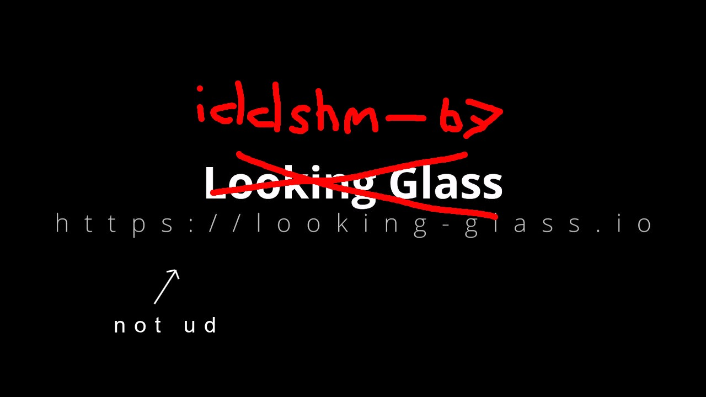

<div align="center">

# IDDShm-B7

**A Looking Glass B7 fork that replaces guest-side capture with a rebranded Indirect Display Driver.**

[](LICENSE)
[](https://looking-glass.io)
[](https://looking-glass.io)
[](https://github.com/weemkvm/iddshm-B7)

The Windows guest presents a virtual display through a UMDF Indirect Display Driver (`ElgDisp.dll`), pushing KVMFR frames over shared memory directly to the Linux host client.

</div>

---

## Table of Contents

- [How It Works](#how-it-works)
- [Stealth Identity](#stealth-identity)
- [Prerequisites](#prerequisites)
- [Quick Start — Using Releases](#quick-start--using-releases)
  - [Step 1 — Load kvmfr (Linux host)](#step-1--load-kvmfr-linux-host)
  - [Step 2 — Wire ivshmem into VM](#step-2--wire-ivshmem-into-vm)
  - [Step 3 — Install IVSHMEM driver (guest)](#step-3--install-ivshmem-driver-guest)
  - [Step 4 — Install ElgDisp IDD driver (guest)](#step-4--install-elgdisp-idd-driver-guest)
  - [Step 5 — Start IDDShmHost (guest)](#step-5--start-iddshm-host-guest)
  - [Step 6 — Start the client (Linux host)](#step-6--start-the-client-linux-host)
- [Building From Source](#building-from-source)
  - [kvmfr kernel module](#kvmfr-kernel-module)
  - [DSE Patcher](#dse-patcher)
  - [ElgDisp IDD Driver](#elgdisp-idd-driver)
  - [IVSHMEM Guest Driver](#ivshmem-guest-driver)
  - [Looking Glass Client](#looking-glass-client)
- [Packaging a Release](#packaging-a-release)
- [Troubleshooting](#troubleshooting)
- [Repo Layout](#repo-layout)
- [Upstream](#upstream)

---

## How It Works

```
┌─────────────────────────────────┐      ┌──────────────────────────────────┐
│         Windows Guest           │      │           Linux Host             │
│                                 │      │                                  │
│  ElgDisp.dll (UMDF IDD)         │      │  looking-glass-client            │
│    │ captures swapchain frames  │      │    │ reads frames from kvmfr0    │
│    ▼                            │      │    ▼                             │
│  IDDShmHost.exe                 │      │  /dev/kvmfr0  ◄─────────────┐   │
│    │ pushes LGMP frames         │      │  kvmfr.ko (kernel module)   │   │
│    ▼                            │      └─────────────────────────────│───┘
│  IVSHMEM device (8086:C0A5) ───────────── ivshmem-plain QEMU device─┘
│    shared memory region (32 MiB)│
└─────────────────────────────────┘
```

---

## Stealth Identity

Every string visible to the OS or anti-cheat is renamed to blend in as an
Elgato capture card display driver — a legitimate IDD device common in gaming setups.

| Original | Renamed |
|:---|:---|
| `IDDShm.dll` | `ElgDisp.dll` |
| Service name `IDDShm` | `ElgDisp` |
| Device group `IDDShmGroup` | `ElgDispGrp` |
| `"IDD Cx Shared Memory Display"` | `"Elgato Virtual Display Adapter"` |
| `"Looking Glass"` endpoint strings | `"Elgato Video Capture"` / `"Elgato Systems GmbH"` |
| Registry `SOFTWARE\Looking Glass` | `SOFTWARE\Elgato Systems` |
| `GUID_DEVINTERFACE_IDDShm` | `GUID_DEVINTERFACE_ElgDisp` (fresh random GUID) |
| WPP trace GUID | Fresh random GUID |
| kvmfr PCI IDs `1AF4:1110` | `8086:C0A5` (Intel vendor, unmapped device ID) |

---

## Prerequisites

### Linux Host
- KVM/QEMU 8+ (project uses custom build at `/opt/AutoVirt/emulator/`)
- Kernel headers for your running kernel
- `x86_64-w64-mingw32-gcc` — only needed if building DSE patcher from source

### Windows Guest
- Windows 11 (tested on 23H2)
- **HVCI (Memory Integrity) must be OFF**
  > Settings → Windows Security → Device Security → Core Isolation → Memory Integrity → **Off** → Reboot
  >
  > Without this, the DSE patcher cannot write to kernel memory.
- Administrator shell for all driver install steps

---

## Quick Start — Using Releases

> [!NOTE]
> If you're wiring this into an existing VM, this is the path. No build tools
> needed in the guest — just download, transfer, and run.

### Get the release files

Download `iddshm-B7-vX.X-guest-drivers.zip` from
[**Releases →**](https://github.com/weemkvm/iddshm-B7/releases)

The archive contains:
```
dse-patcher.exe
ElgDisp.dll
ElgDisp.inf
ivshmem.sys
ivshmem.inf
```

> [!IMPORTANT]
> You also need **`RTCore64.sys`** — this is not bundled (closed binary).
> Grab it from your MSI Afterburner install directory:
> ```
> C:\Program Files (x86)\MSI Afterburner\RTCore64.sys
> ```
> Place it in the same folder as `dse-patcher.exe` before running anything.

---

### Step 1 — Load kvmfr (Linux host)

```bash
cd module/
make -C /lib/modules/$(uname -r)/build M=$(pwd) modules
sudo insmod kvmfr.ko static_size_mb=32

# Set permissions
sudo chmod 660 /dev/kvmfr0
sudo chown $USER:kvm /dev/kvmfr0
```

<details>
<summary>Make it persist across reboots</summary>

Create `/etc/modprobe.d/kvmfr.conf`:
```
options kvmfr static_size_mb=32
```

Create `/etc/modules-load.d/kvmfr.conf`:
```
kvmfr
```

</details>

---

### Step 2 — Wire ivshmem into VM

`virsh edit <vmname>` — add inside the existing `<qemu:commandline>` block:

```xml
<qemu:arg value='-object'/>
<qemu:arg value='memory-backend-file,id=kvmfr0mem,share=on,mem-path=/dev/kvmfr0,size=32M'/>
<qemu:arg value='-device'/>
<qemu:arg value='ivshmem-plain,id=kvmfr0,memdev=kvmfr0mem,bus=pcie.0,addr=0x10,vendor-id=0x8086,device-id=0xC0A5'/>
```

> [!NOTE]
> `addr=0x10` must be a free PCIe slot. Check used slots:
> ```bash
> virsh dumpxml <vmname> | grep "slot="
> ```

---

### Step 3 — Install IVSHMEM driver (guest)

Transfer the release folder + `RTCore64.sys` into the guest.

Open an **Administrator** CMD or PowerShell:

```bat
dse-patcher.exe ivshmem.inf
```

✅ **Expected:** ends with `SUCCESS — ElgDisp driver installed.`

Verify in Device Manager → System devices → device with `PCI\VEN_8086&DEV_C0A5`.

---

### Step 4 — Install ElgDisp IDD driver (guest)

```bat
dse-patcher.exe ElgDisp.inf
```

✅ **Verify:** Device Manager → Display adapters → `"Elgato Virtual Display Adapter"`

---

### Step 5 — Start IDDShmHost (guest)

```bat
IDDShmHost.exe --install
net start IDDShmHost
```

---

### Step 6 — Start the client (Linux host)

```bash
./looking-glass-client
```

The client reads from `/dev/kvmfr0` and should begin receiving frames once
IDDShmHost is running and ElgDisp is presenting.

---

## Building From Source

### kvmfr kernel module

```bash
cd module/
make -C /lib/modules/$(uname -r)/build M=$(pwd) modules
# Output: kvmfr.ko
```

---

### DSE Patcher

Cross-compiled from Linux to a Windows x64 EXE.

```bash
# Install MinGW if needed
# Arch/CachyOS:
sudo pacman -S mingw-w64-gcc
# Debian/Ubuntu:
sudo apt install gcc-mingw-w64-x86-64

cd tools/dse-patcher/
make
# Output: dse-patcher.exe
```

---

### ElgDisp IDD Driver

> [!IMPORTANT]
> Must be built on Windows. UMDF drivers cannot be cross-compiled.

**Requirements:** Visual Studio 2022 + Windows Driver Kit (WDK), matching SDK version.

1. Open `idd\LGIdd.sln` in Visual Studio 2022
2. Select **Release | x64**
3. Build
4. Output: `x64\Release\ElgDisp.dll`
5. Rename `IDDShm.inf` → `ElgDisp.inf` and place alongside the DLL

---

### IVSHMEM Guest Driver

The guest needs an IVSHMEM driver patched to match PCI ID `8086:C0A5` and the
custom interface GUID `{8f008348-dfa6-43bc-8e2f-6ceb67577fc6}`.

1. Clone [kvm-guest-drivers-windows](https://github.com/virtio-win/kvm-guest-drivers-windows)

2. Edit `ivshmem\ivshmem.inf` — change the hardware ID:
   ```ini
   %ivshmem.DeviceDesc%=ivshmem_Device, PCI\VEN_8086&DEV_C0A5
   ```

3. Edit `ivshmem\ivshmem.h` — replace the interface GUID:
   ```c
   DEFINE_GUID(GUID_DEVINTERFACE_IVSHMEM,
     0x8f008348,0xdfa6,0x43bc,0x8e,0x2f,0x6c,0xeb,0x67,0x57,0x7f,0xc6);
   ```

4. Build with VS 2022 + WDK → `ivshmem.sys` + `ivshmem.inf`

Install via `dse-patcher.exe ivshmem.inf` same as ElgDisp.

---

### Looking Glass Client

```bash
cd client/
mkdir build && cd build
cmake ..
make -j$(nproc)
# Output: looking-glass-client
```

---

## Packaging a Release

When building a release zip, structure it as:

```
iddshm-B7-vX.X-guest-drivers.zip
├── dse-patcher.exe       ← tools/dse-patcher/make
├── ElgDisp.dll           ← VS build (x64/Release/)
├── ElgDisp.inf           ← renamed IDDShm.inf
├── ivshmem.sys           ← patched build
└── ivshmem.inf           ← patched INF
```

> [!WARNING]
> Do **not** bundle `RTCore64.sys` in public releases.

---

## Troubleshooting

| Symptom | Cause | Fix |
|:---|:---|:---|
| Device code **52** (unsigned driver) | HVCI still enabled | Turn off Memory Integrity → Reboot → Retry |
| Device code **10** (failed to start) | IDD init error | Check Event Viewer → System for IDD/UMDF errors |
| `pnputil` non-zero exit | Not running as admin | Open CMD as Administrator, not just elevated |
| `RTCore64` device not found | Driver didn't load | Check SCM: `sc query RTCore64` — may need to restart after HVCI off |
| `dse-patcher` can't find `g_CiEnabled` | ci.dll version changed | Open an issue with your Win11 build number |
| ivshmem device not appearing in guest | Wrong PCI slot / QEMU version | Check QEMU supports `vendor-id`/`device-id` on `ivshmem-plain` (needs QEMU 8+) |

---

## Repo Layout

```
idd/LGIdd/          Windows IDD driver source (UMDF2)
  IDDShm.inf        INF — installs as ElgDisp / Elgato Virtual Display Adapter
module/             Linux kvmfr kernel module
host/               IDDShmHost service
client/             Looking Glass host client (Linux)
tools/
  dse-patcher/      Unsigned driver installer — DSE bypass via RTCore64
vendor/             Third-party headers (ivshmem, directx, getopt)
```

---

## Upstream

- [Looking Glass](https://github.com/gnif/LookingGlass) — base project
- [Docs](https://looking-glass.io)

**License:** GPLv2 (inherited from Looking Glass)